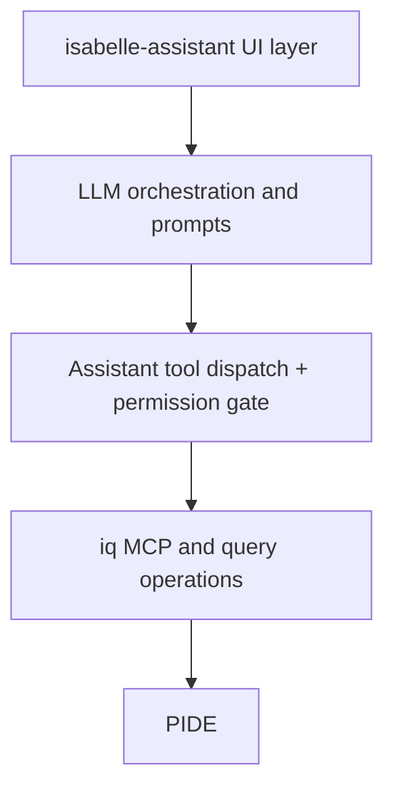
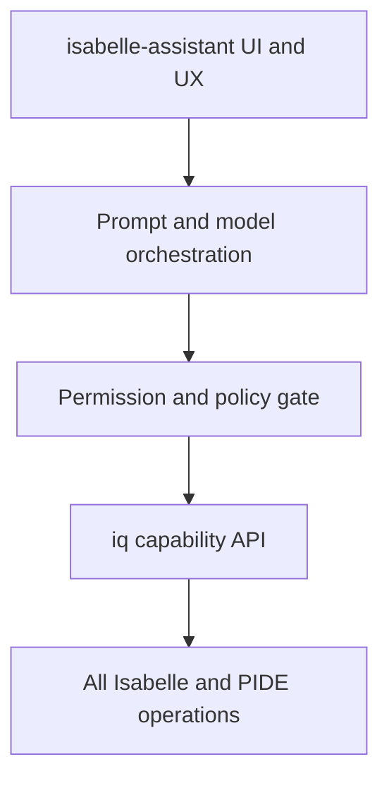

# Architecture: Current State and Target State

Status: Active steering document  
Applies to: `iq`, `isabelle-assistant`  
Last reviewed: 2026-02-21

## Purpose

This document records current architecture, defines target architecture, and makes the delta explicit.

## Current Architecture

The current system is layered with a hard boundary gate and zero assistant-side runtime exceptions.

### Current Responsibilities

- `isabelle-assistant` owns:
  - UI and menu actions.
  - Bedrock model invocation and tool-use loop.
  - Prompt loading and response rendering.
  - Tool permission checks.
- `iq` owns:
  - MCP server and socket protocol entrypoint.
  - Isabelle query/explore operations.
  - server-side path and bind security constraints.

### Known Coupling Points

Assistant-side direct runtime touchpoints are prohibited. Current expected count: zero.

Inventory source of truth:
- `design-documents/10-assistant-runtime-boundary-inventory.tsv`

## Target Architecture

### Target Responsibilities

- `isabelle-assistant` should own only:
  - UI interactions and rendering.
  - prompt construction and system prompt transport.
  - model/session orchestration.
  - user-visible permission controls and audit display.
- `iq` should own:
  - all Isabelle state reads and writes.
  - all proof-execution, verification, and search tool execution.
  - operation-level security checks and path constraints.
  - robust error normalization for assistant consumption.

## Architectural Rules

1. No new direct `isabelle.jedit` or PIDE operational logic should be added to assistant action code when equivalent `iq` capabilities can exist.
2. New proof-related tools should be defined at the `iq` layer first, then consumed by assistant.
3. Assistant should treat tool outputs as typed capability responses, not raw ad hoc strings.
4. Security and permission decisions must remain visible to the user.
5. Direct runtime touchpoints in assistant are disallowed and enforced by failing gates.

## Migration Direction

- Phase out assistant-local proof execution helpers.
- Add missing `iq` capabilities required by assistant actions.
- Introduce typed adapter layer in assistant for `iq` responses.

## Acceptance Checks

A new feature is architecturally compliant when:

1. The Isabelle interaction path is represented as an `iq` capability.
2. Assistant-side code remains orchestration-only for that interaction.
3. Failures are recoverable and clearly surfaced at UI level.
4. No direct runtime touchpoint is introduced in assistant code.
