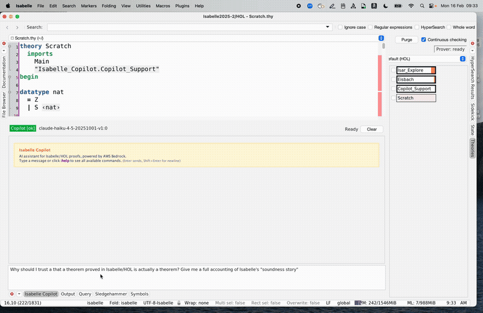
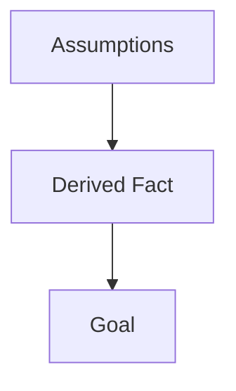
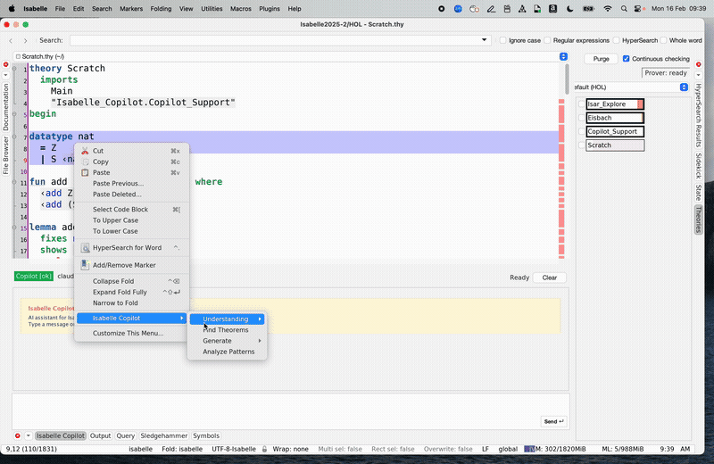
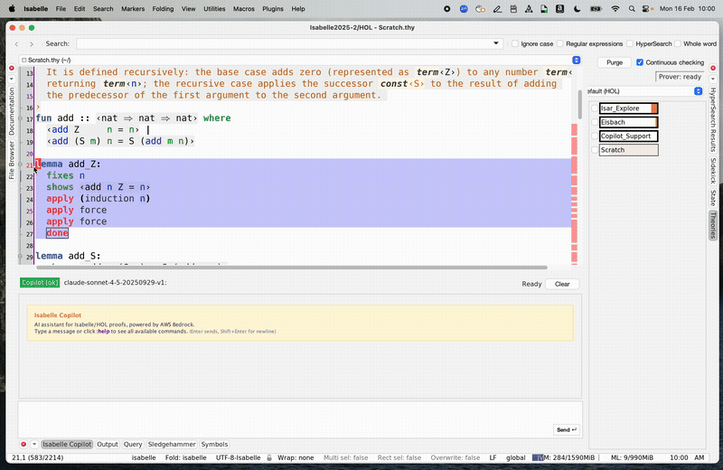
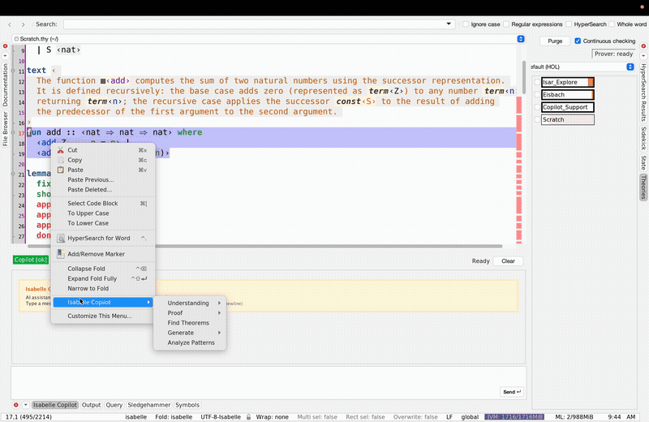

# Isabelle Assistant

LLM-powered proof assistant for [Isabelle/jEdit](https://isabelle.in.tum.de/), built on [AWS Bedrock](https://aws.amazon.com/bedrock/). Provides interactive chat with LaTeX and Mermaid rendering, proof suggestions, code generation, refactoring, and more — all integrated into the Isabelle/jEdit IDE via a dockable chat panel and context-sensitive right-click menu.

Isabelle Assistant is part of the [AutoCorrode](https://github.com/awslabs/AutoCorrode) project.

## Architecture

Isabelle Assistant combines four main layers:

1. jEdit UI integration (`AssistantPlugin`, `AssistantDockable`, context menus, chat actions)
2. LLM orchestration (`BedrockClient`, prompts, tool-use loop, retry/caching)
3. Isabelle context/proof pipelines (`ContextFetcher`, `GoalExtractor`, `SuggestAction`)
4. Optional I/Q integration for proof-state operations and verification (`IQIntegration`)

For contributor-level component and threading details, see [CONTRIBUTING.md](CONTRIBUTING.md).

## Highlights

### Freeform Chat

Ask natural language questions about Isabelle/HOL directly in the IDE. The chat panel supports Markdown formatting, syntax-highlighted Isabelle code blocks with one-click insertion, rendered LaTeX mathematics, and Mermaid diagrams (offline via local `mmdc`).



With Anthropic Claude models, the LLM has autonomous access to tools for reading theory files, checking proof state, searching for theorems, and verifying proofs — enabling it to ground its responses in the actual content of your development.

### LaTeX Rendering

Mathematical notation in chat responses is rendered as LaTeX via [JLaTeXMath](https://github.com/opencollab/jlatexmath), both inline (`$...$`) and display (`$$...$$`).


### Mermaid Rendering

Mermaid diagrams in fenced blocks are rendered to images offline using local Mermaid CLI (`mmdc`):



If `mmdc` is unavailable, the Assistant shows a graceful fallback message and preserves the original Mermaid source block.

For sandboxed or restricted environments where subprocess execution must be disabled, set:
`-Dassistant.mermaid.disable_subprocess=true`

### Explain

Explain any Isabelle command, definition, or error at the cursor or in a selection. The LLM receives the surrounding theory context for targeted explanations.



### Refactor to Isar

Convert apply-style proof scripts to structured Isar proofs. The generated Isar proof is automatically verified against Isabelle (when I/Q is available) and retried with error feedback if verification fails.



### Generate Documentation

Generate documentation comments for definitions, theorems, and other Isabelle commands. The LLM inspects the command type and surrounding context to produce appropriate documentation.


### Generate Introduction Rules

Generate introduction and elimination rules for inductive definitions and datatypes.


### Generate Test Cases

Generate QuickCheck-style test cases and examples for definitions.



### Configuration

All settings are accessible via **Plugins → Plugin Options → Isabelle Assistant** or the `:set` chat command. Configure AWS region, model selection, temperature, verification timeouts, and more.


## Prerequisites

- [Isabelle2025-2](https://isabelle.in.tum.de/website-Isabelle2025-2/)
- AWS account with [Bedrock model access](https://docs.aws.amazon.com/bedrock/latest/userguide/model-access.html) (Claude recommended)
- AWS credentials configured (`~/.aws/credentials` or environment variables)

## Setup

1. Download dependencies:
   ```bash
   ./fetch-deps.sh
   ```

2. Build and install (includes the [I/Q](../iq) plugin for proof verification):
   ```bash
   make install
   ```

3. Restart Isabelle/jEdit. The Assistant panel appears as a dockable.

4. Configure your model via **Plugins → Plugin Options → Isabelle Assistant**, or `:set model <model-id>` in the chat.

For full feature support, import the Assistant support theory in your development:
```isabelle
imports "Isabelle_Assistant.Assistant_Support"
```

This provides Eisbach (for tactic generation) and Isar_Explore (for I/Q integration). The status bar shows the current support level:
- **Assistant ✓** — `Assistant_Support` imported, all features available
- **Assistant: Partial** — I/Q or Eisbach available but not both
- **Assistant (LLM only)** — no I/Q or Eisbach; chat and LLM features still work

## Features

### Context Menu

Right-click in any `.thy` file to access the **Isabelle Assistant** submenu. Available actions adapt to context — proof state, text selection, cursor position, error presence, and I/Q availability.

### Feature Overview

| Category | Feature | Description | I/Q |
|----------|---------|-------------|:---:|
| **Understanding** | Explain | Explain code at cursor or selection | |
| | Explain Error | Analyze error messages | |
| | Show Type | Display type information at cursor | |
| | Summarize Theory | Summarize theory content | |
| | Explain Counterexample | Explain nitpick/quickcheck counterexamples | |
| **Proof** | Suggest Proof Step | LLM proof suggestions with optional sledgehammer | for verification |
| | Suggest Strategy | High-level proof strategy recommendations | |
| | Sledgehammer | Run external ATP provers | ✓ |
| | Nitpick | Search for counterexamples | ✓ |
| | Quickcheck | Test conjectures with random examples | ✓ |
| | Try Methods | Try simp/auto/blast/force/fastforce | ✓ |
| | Trace Simplifier | Trace simp/auto rewriting steps | ✓ |
| | Print Context | Show proof context (assumptions, goals) | ✓ |
| **Refactoring** | Refactor to Isar | Convert apply-style to structured Isar | for verification |
| | Tidy | Clean up formatting and cartouches | for verification |
| | Extract Lemma | Extract proof steps into a separate lemma | for verification |
| **Generation** | Doc Comment | Generate documentation comments | |
| | Intro/Elim Rules | Generate introduction and elimination rules | |
| | Test Cases | Generate QuickCheck-style test cases | |
| | Suggest Name | Suggest descriptive names for definitions/lemmas/theorems | |
| | Suggest Tactic | Generate Eisbach methods | |
| **Analysis** | Analyze Patterns | Analyze proof patterns and suggest improvements | |
| | Find Theorems | Search for matching theorems | ✓ |
| **Navigation** | List Theories | List open theory files | |
| | Read Theory | Display theory content | |
| | Search in Theory | Search for patterns within a theory | |
| | Theory Dependencies | Show theory import graph | |

### Verification Badges

When I/Q is available, generated proofs are automatically verified against Isabelle before display. Failed proofs are retried with error feedback. Results show verification badges:

- **✓ Verified** — proof checked by Isabelle
- **⚡ Sledgehammer** — found by external provers
- **? Unverified** — not checked (I/Q unavailable)
- **✗ Failed** — verification failed after retries

Verification cache semantics: only successful verification outcomes are cached. Failed, timeout, and unavailable outcomes are not cached, so retries always re-run verification.

### Tool Use (Anthropic Models)

With Anthropic Claude models, the LLM can autonomously use tools during chat:

| Tool | Description |
|------|-------------|
| `read_theory` | Read lines from an open theory file |
| `list_theories` | List all open theory files |
| `search_in_theory` | Search for patterns in a theory |
| `get_goal_state` | Get the current proof goal |
| `get_proof_context` | Get local facts and assumptions |
| `find_theorems` | Search for library theorems (I/Q) |
| `verify_proof` | Verify a proof method (I/Q) |
| `run_sledgehammer` | Run automated proof search (I/Q) |

Tool execution is gated by a per-tool permission system with four levels:

- `Allow`: execute without prompt
- `Ask at First Use`: prompt once per session, then remember the decision
- `Ask Always`: prompt every time
- `Deny`: hide tool from the model and reject invocations

Defaults are conservative: read-only tools are `Allow`, I/Q compute tools are `Ask at First Use`, and side-effecting tools (`edit_theory`, `create_theory`, `open_theory`, `web_search`) are `Ask Always`.

Permission prompts include the target resource and a sanitized argument summary so the user can approve with concrete context. Sensitive argument names (for example `*_token`, `*_secret`, `*_password`) are redacted in the prompt summary.

Additional safety checks:

- `create_theory` only accepts valid Isabelle theory file names (no path separators / traversal)
- file creation is restricted to the current buffer directory
- `edit_theory` and `create_theory` preserve user-provided leading/trailing whitespace in inserted content

## Chat Commands

Type `:help` in the chat to see all commands. Commands are prefixed with `:`.

| Command | Description |
|---------|-------------|
| `:help` | Show all commands |
| `:explain [target]` | Explain code at location |
| `:explain-error` | Explain error at cursor |
| `:explain-counterexample` | Explain counterexample |
| `:suggest [target]` | Suggest proof steps |
| `:suggest-name` | Suggest descriptive names for definitions/lemmas/theorems |
| `:suggest-strategy` | Recommend proof strategy |
| `:suggest-tactic` | Generate Eisbach method |
| `:tidy` | Clean up formatting |
| `:refactor` | Convert to Isar |
| `:extract` | Extract lemma from selection |
| `:find <pattern>` | Search for theorems |
| `:sledgehammer` | Run sledgehammer |
| `:nitpick` | Run nitpick |
| `:quickcheck` | Run quickcheck |
| `:try-methods` | Try common proof methods |
| `:trace` | Trace simplifier |
| `:print-context` | Show proof context |
| `:show-type` | Show type at cursor |
| `:summarize` | Summarize current theory |
| `:analyze` | Analyze proof patterns |
| `:generate-doc` | Generate documentation |
| `:generate-intro` | Generate intro rule |
| `:generate-elim` | Generate elim rule |
| `:generate-tests` | Generate test cases |
| `:verify <proof>` | Verify proof text |
| `:theories` | List open theories |
| `:read <theory>` | Show theory content |
| `:deps <theory>` | Show theory dependencies |
| `:search <theory> <pattern>` | Search in theory |
| `:models` | Refresh available models |
| `:set [key [value]]` | View/change settings |

### Target Syntax

Commands like `:explain` and `:suggest` accept optional targets:
- `cursor` or `current` — current cursor position (default)
- `selection` — current text selection
- `Theory.thy:42` — specific line in a theory
- `Theory.thy:10-20` — line range
- `Theory.thy:lemma_name` — named element
- `cursor+5`, `cursor-3` — relative offset

## Configuration

Access via **Plugins → Plugin Options → Isabelle Assistant** or `:set` in chat.

| Setting | Default | Description |
|---------|---------|-------------|
| `region` | us-east-1 | AWS region |
| `model` | (none) | Bedrock model ID |
| `cris` | true | Cross-Region Inference (CRIS) |
| `temperature` | 0.3 | Sampling temperature (0.0–1.0) |
| `max_tokens` | 4000 | Max response tokens |
| `max_tool_iterations` | 10 | Max tool-use iterations (Anthropic) |
| `max_retries` | 3 | Verification retry attempts |
| `verify_timeout` | 30000 | Verification timeout (ms) |
| `verify_suggestions` | true | Verify proofs via I/Q |
| `use_sledgehammer` | false | Run sledgehammer in parallel with suggestions |
| `sledgehammer_timeout` | 15000 | Sledgehammer timeout (ms) |
| `max_verify_candidates` | 5 | Max suggestions to verify |
| `find_theorems_limit` | 20 | Max theorems for context |
| `find_theorems_timeout` | 10000 | Find theorems timeout (ms) |
| `trace_timeout` | 10 | Simplifier trace timeout (s) |
| `trace_depth` | 3 | Simplifier trace depth |

### AWS Credentials

Credentials are read from the standard AWS credential chain:
- Environment variables (`AWS_ACCESS_KEY_ID`, `AWS_SECRET_ACCESS_KEY`)
- Credentials file (`~/.aws/credentials`)
- IAM instance profile (on EC2)

### Cross-Region Inference (CRIS)

Enabled by default. Automatically prefixes model IDs with `us.` or `eu.` for supported providers (Anthropic, Meta, Mistral).

## Development

```bash
make help       # Show available targets
make build      # Build the plugin
make test       # Compile and run the full strict unit test suite (CI-gating)
make install    # Build and install (includes I/Q)
make clean      # Remove build artifacts
make debug      # Show build configuration
```

`make test` is intentionally strict:
- It fails on any test compile/runtime failure.
- It rejects `pending`/ignored tests and broad exception-swallowing in test sources.
- It enforces ownership checks for critical modules.

## License

This project is licensed under the MIT License. See the [LICENSE](../LICENSE) file.
